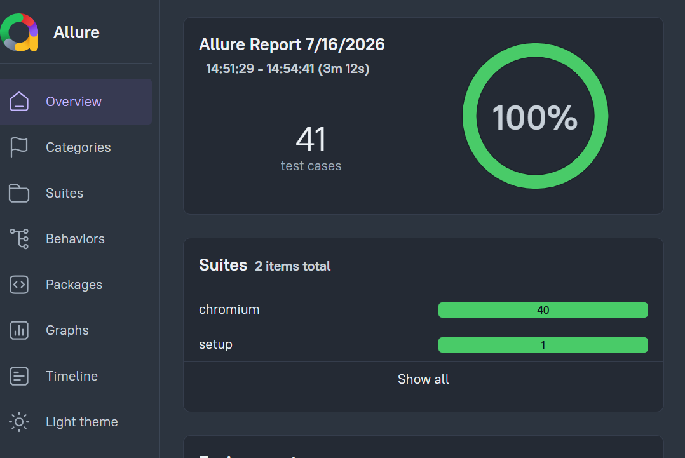
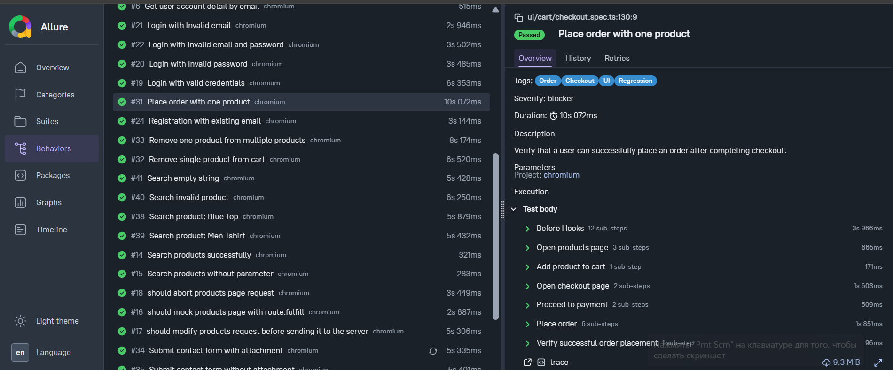

# Playwright Automation Framework

[](https://github.com/Maria-Markovych/playwright-automation-framework/actions/workflows/playwright.yml)

A scalable end-to-end test automation framework built with **Playwright and TypeScript**.

The project demonstrates UI and API test automation using a layered architecture with Page Object Model, reusable UI components, custom fixtures, API service classes, test data management, network mocking, Allure reporting, and GitHub Actions CI.

---

## Tech Stack

* **Playwright** — UI and API test automation
* **TypeScript** — strongly typed test development
* **Allure** — test reporting
* **dotenv** — environment configuration
* **GitHub Actions** — CI execution
* **Page Object Model** — UI abstraction
* **REST API testing** — API service layer and typed models

---

## Project Structure

```text
.
├── .github/
│   └── workflows/
│       └── playwright.yml
│
├── api/
│   ├── client/
│   │   ├── ApiClient.ts
│   │   └── Endpoints.ts
│   │
│   ├── models/
│   │   ├── requests/
│   │   └── responses/
│   │
│   └── services/
│       ├── AccountService.ts
│       ├── BrandsService.ts
│       ├── LoginService.ts
│       └── ProductsService.ts
|
├── docs/  
|   └── images/ 
|       ├── allure-overview.png 
│       └── allure-behavior-details.png│
|
├── factories/
│   ├── AccountFactory.ts
│   ├── AddressFactory.ts
│   ├── CreateAccountFactory.ts
│   └── UserFactory.ts
│
├── fixtures/
│   ├── api.ts
│   ├── ui.ts
│   └── index.ts
│
├── models/
│   └── UI data models
│
├── playwright/
│   └── .auth/       # generated locally, excluded from Git
│
├── test-data/
│   ├── api/
│   ├── files/
│   └── ui/
│
├── tests/
│   ├── api/
│   │   ├── account.spec.ts
│   │   ├── brands.spec.ts
│   │   ├── login.spec.ts
│   │   └── products.spec.ts
│   │
│   ├── network/
│   │   └── mocking.spec.ts
│   │
│   └── ui/
│       ├── auth/
│       ├── cart/
│       ├── contact/
│       └── products/
│
├── ui/
│   ├── components/
│   ├── containers/
│   ├── pages/
│   └── widgets/
│
├── utils/
│   └── env.ts
│
├── .env.example
├── .gitignore
├── package.json
├── playwright.config.ts
└── README.md
```

---

## Test Coverage

### UI Testing

The UI test suite covers:

* User authentication
* User registration
* Product details
* Product search
* Product filtering by category
* Shopping cart
* Adding products to the cart
* Removing products from the cart
* Product quantity management
* Checkout flow
* Contact Us form

### API Testing

The API test suite covers:

* Products API
* Brands API
* Login API
* Account creation
* Account details
* Account deletion
* API response validation
* Negative scenarios

### Network Mocking

The project demonstrates Playwright network interception using:

* `route.fulfill()` — mock server responses
* `route.continue()` — modify requests before sending them
* `route.abort()` — abort network requests and verify failure handling

### Reporting

* Allure reporting
* Playwright HTML report
* Screenshots on failure
* Video recording on failure
* Traces for debugging

---

## Architecture

The framework follows a layered architecture designed to keep test scenarios readable and implementation details isolated.

### UI Layer

The UI automation layer is based on the Page Object Model and separates test scenarios from UI implementation details.

```text
Tests
  ↓
Pages
  ↓
Components / Containers / Widgets
  ↓
Playwright Locators
```

Tests focus on user behaviour, while page objects and reusable UI components contain interaction logic.

---

### API Layer

API tests use a layered service-based architecture.

```text
Tests
  ↓
Services
  ↓
API Client
  ↓
Endpoints
  ↓
API
```

The API layer includes:

* reusable API client;
* centralized endpoints;
* service classes;
* typed request models;
* typed response models;
* API fixtures.

This structure keeps API tests focused on business behaviour rather than request construction details.

---

## Fixtures

Custom Playwright fixtures provide reusable test setup and dependencies.

### UI Fixtures

Examples:

```text
loggedHomePage
loggedCartPage
loggedContactUsPage
```

The `loggedHomePage` fixture provides a ready-to-use authenticated page object.

UI tests can focus on test scenarios without repeating browser context and authentication setup.

### API Fixtures

API fixtures provide reusable service instances such as:

```text
productsService
loginService
accountService
```

This allows API tests to work directly with service methods.

---

## Test Data Management

Test data is separated from test implementation.

```text
test-data/
├── api/
├── files/
└── ui/
```

The framework also uses factories to create reusable and configurable test objects.

This approach helps to:

* reduce hardcoded values in tests;
* improve readability;
* reuse test data;
* simplify data maintenance.

---

## Authentication

The framework uses Playwright authentication state to reuse authenticated sessions across UI tests.

Authentication is prepared during the setup project and the generated storage state is stored locally in:

```text
playwright/.auth/
```

The authentication state is excluded from version control.

Authenticated UI fixtures can then reuse this state without repeating the login flow before every test.

---

## Network Mocking

The project contains dedicated examples demonstrating Playwright network interception capabilities.

The examples cover:

* completely mocking a server response;
* modifying a request before it is sent;
* aborting a network request;
* verifying request failure handling.

These examples demonstrate different approaches to controlling network behaviour during automated tests.

---

## Environment Configuration

The project uses environment variables for configuration.

A template configuration file is provided:

```text
.env.example
```

To run the project locally, create a `.env` file based on this template.

Sensitive configuration and local environment files are excluded from version control.

---

## Installation

Install project dependencies:

```bash
npm install
```

Install Playwright browsers:

```bash
npx playwright install
```

---

## Running Tests

### Run all tests

```bash
npm run all
```

### Run UI tests

```bash
npm run uitests
```

### Run API tests

```bash
npm run apitests
```

### Run network mocking tests

```bash
npm run networktests
```

---

## Playwright Report

After test execution, the Playwright HTML report can be opened with:

```bash
npm run report
```

---

## Allure Report

Generate and open the Allure report with:

```bash
npm run allure
```

The report provides detailed information about:

* test execution results;
* test steps;
* severity;
* tags;
* failure details.

The Allure report provides both a high-level overview of the complete test execution and detailed information about individual test cases.

Test Execution Overview

The Overview section provides a summary of the test run, including the total number of tests and their execution results.


Test Details

The Behaviors section provides detailed information about individual tests, including test descriptions, tags, severity and other test metadata.


---

## CI/CD

The project includes a GitHub Actions workflow for automated test execution.

The CI pipeline is configured to:

* install project dependencies;
* install Playwright browsers;
* execute automated tests;
* retry failed tests on CI;
* prevent accidental execution of `test.only`.

---

This project demonstrates practical experience in:

* UI and API test automation;
* Playwright and TypeScript;
* Page Object Model;
* layered framework architecture;
* reusable fixtures;
* API service abstraction;
* test data management;
* network mocking;
* Allure reporting;
* CI/CD integration with GitHub Actions.
